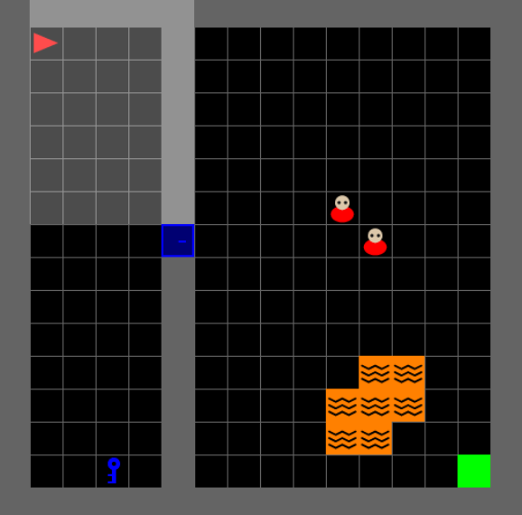
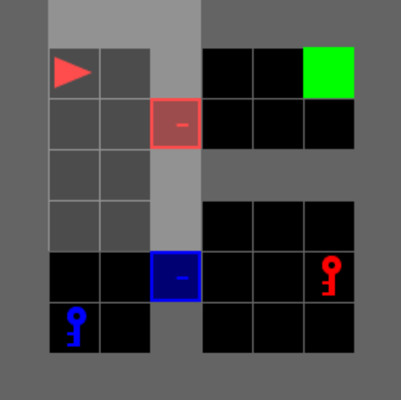
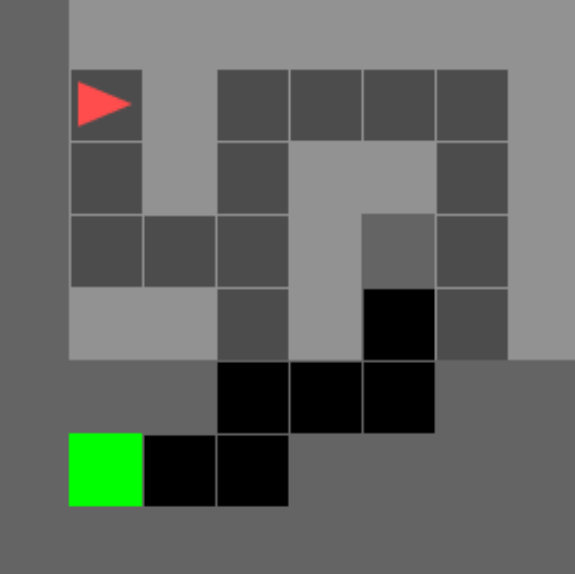

# gym-minigrid

The goal of this repository is to train an autonomous autonomous agent to solve multi-stage logic puzzles within the Gym MiniGrid framework using Deep Reinforcement Learning. The project utilizes the Proximal Policy Optimization (PPO) algorithm and explores the critical impact of reward shaping and custom Convolutional Neural Network (CNN) architectures in helping the agent overcome local minima,

## Features
* **Custom MiniGrid Environments:** Three distinct map layouts designed to test specific agent capabilities (hazard avoidance, sequential logic, and spatial generalization).
  <table>
  <tr>
    <td width="33%"></td>
    <td width="33%"></td>
    <td width="33%"></td>
  </tr>
</table>

* **Custom Entity Rendering:** Implementation of a `RimWorldEnemy` using procedural geometric primitives.
* **Optimized Vision System:** A lightweight CNN feature extractor optimized for grid-based environments.
* **Visualization Tools:** Utilities to generate side-by-side video comparisons of baseline vs. trained agents.
* **Evaluation Tools:** Utilities to report on metrics abou trained models.

## Key Results
Summary of important outcomes from some of the experiments. 

| Experiment | Timesteps | Success Rate | Average Return | Notes |
| :--- | :---: | :---: | :---: | :--- |
| Map 1 | 1.000.000 | (fill in) | (fill in) | Dense Rewards (16x16 Size) |
| Map 1 | 100.000 | (fill in) | (fill in) | Dense Rewards (16x16 Size) |
| Map 2 | 1.000.000 | (fill in) | (fill in) | Sequential Logic (8x8 Size) |
| Map 2 | 100.000 | (fill in) | (fill in) | Sequential Logic (8x8 Size) |
| Map 3 | 1.000.000 | (fill in) | (fill in) | Sparse Rewards (8x8 Size) |
| Map 3 | 100.000 | (fill in) | (fill in) | Sparse Rewards (8x8 Size) |

## Setup / Virtual Enviroment

Clone the repository and set up a virtual environment:

```bash
# Clone the repository
git clone https://github.com/lazoulios/gym-minigrid
cd gym-minigrid

# Create and activate the virtual environment
python -m venv venv
source venv/bin/activate  # Use venv\Scripts\activate.bat on Windows CMD

# Install dependencies from requirements.txt
pip install -r requirements.txt
```

## Running training
Use the provided training script to train agents. Will train an agent on each map independently.
```bash
python app/src/train.py 
```

## Evaluation and visualization
- Use `app/utils/video_overlay.py` to record and overlay agents (or random moves bot).
- Use `app/utils/evaluate_agents.py` to calculate metrics on trained agents.
- Logs and tensorboard runs are stored under `app/data/runs/`. Use 
`tensorboard --logdir app/data/runs/` to view

## Project structure

```
gym-minigrid/
├── app/
│   ├── src/                # environment maps and training scripts
│   │   ├── first_map.py
│   │   ├── second_map.py
│   │   ├── third_map.py
│   │   ├── enemy.py
│   │   └── train.py
|   ├── utils/              # helpers (geometry, video overlays, evaluation script)
│   └── data/               # models, media, run logs, tensorboard
├── tex/                    # latex report code and media
├── requirements.txt
└── README.md
```
